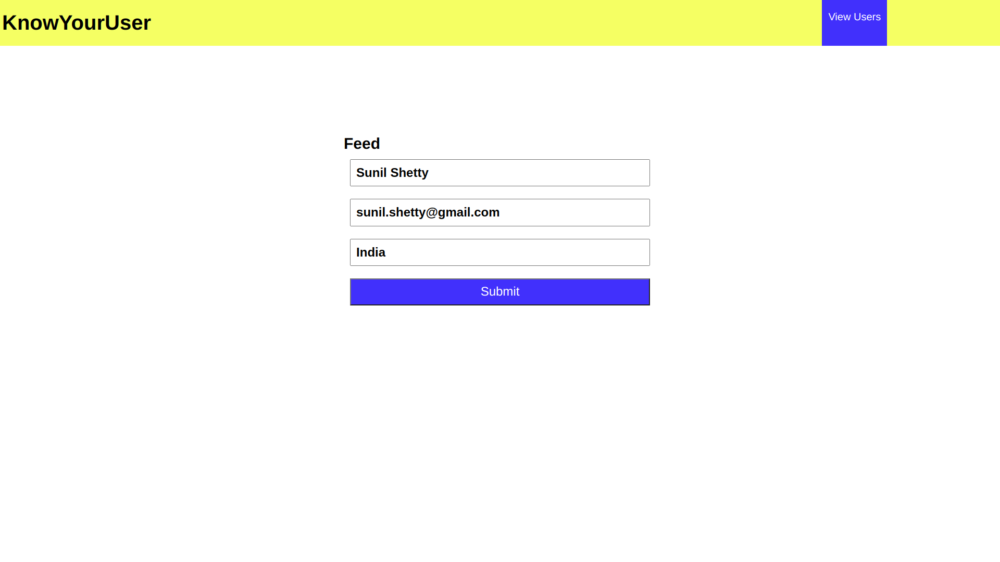
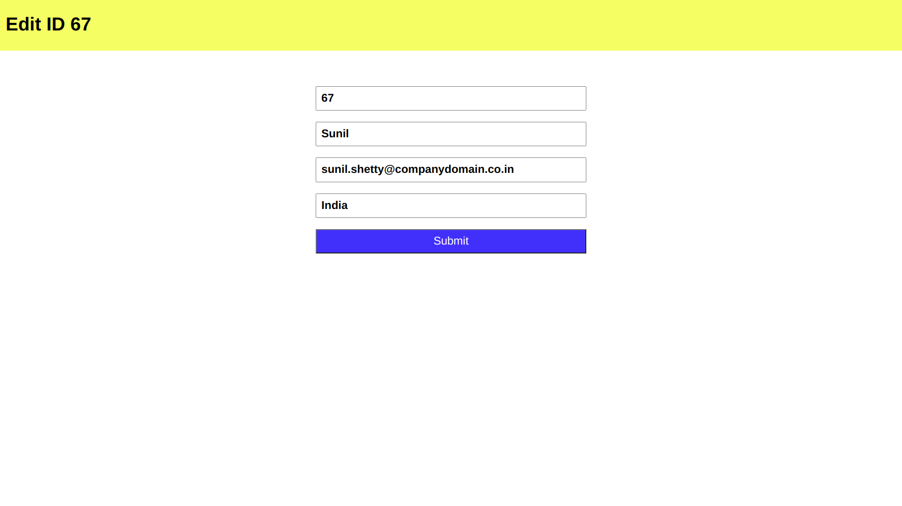
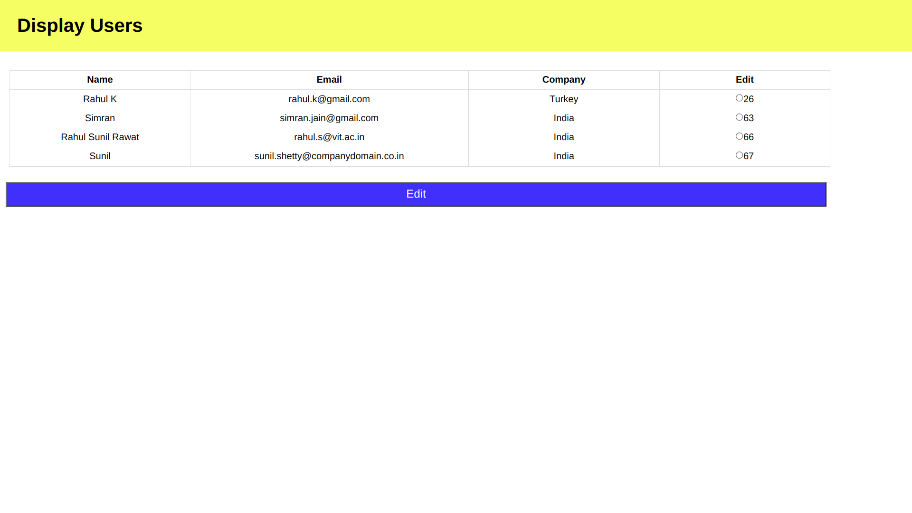

# KnowYourUser

KnowYourUser is a Model View Controlled based central accounts portal. The portal helps in creating a feed for visitors in corporate spaces and helps to keep track of the visitors to the space.

## Technology Used

1. Spring Core
2. Spring MVC
3. Maven (Project Build)

## Design Patterns Used

1. Model View Controller Architecture
2. Data Access Object (DAO) Pattern

## Screenshots of the application

1. Feeding the details of the user to the KnowYourUser portal

2. Displaying the details of all the users from the central database

3. Editing the details of an entered user from the database

4. Displaying the details of all the users after editing the details

